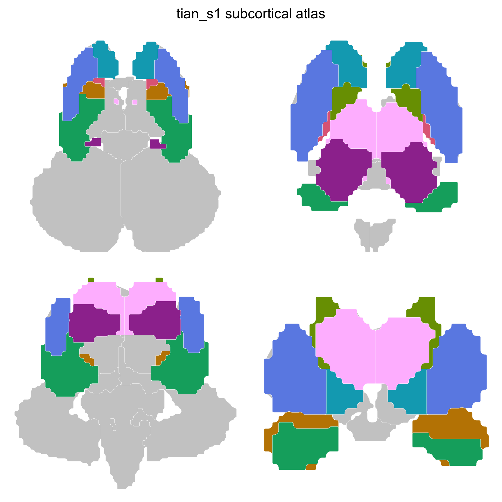
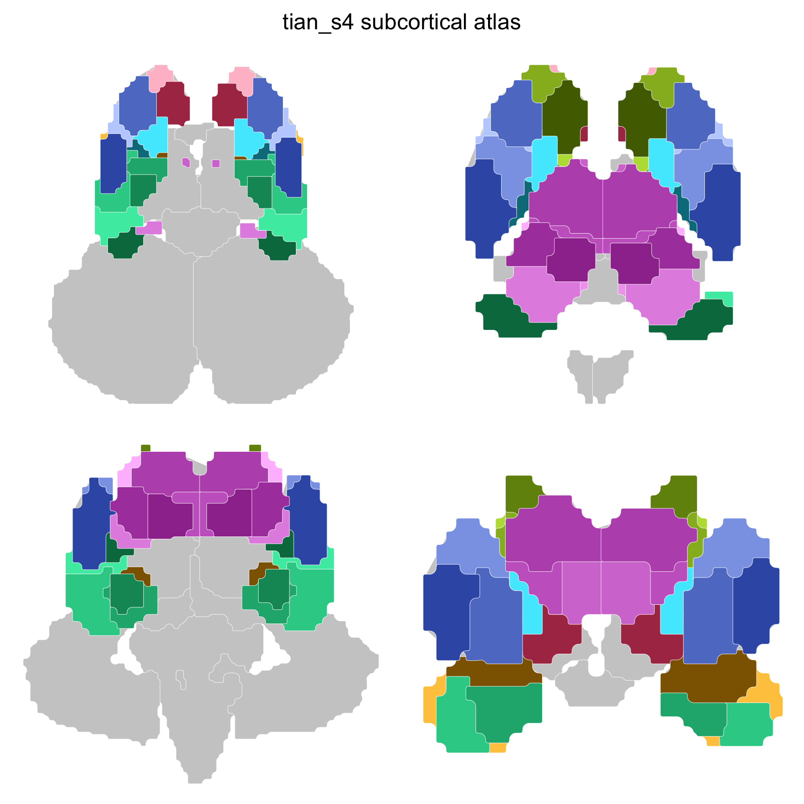

# ggsegTian

The Melbourne Subcortex Atlas for the ggseg ecosystem.

Tian and colleagues parcellated the human subcortex from resting-state
functional connectivity gradients, at four nested scales. Scale I splits
the subcortex into 8 structures per hemisphere; each finer scale
subdivides the scale above, down to 27 structures per hemisphere at
scale IV.

Each scale ships in a 3 Tesla and a 7 Tesla variant; the 7T
parcellations are derived from higher resolution data and are slightly
finer at the same scale.

| Scale | 3T | Structures/hemi | 7T | Structures/hemi |
|----|----|----|----|----|
| I | [`tian_s1()`](https://ggsegverse.github.io/ggsegTian/reference/tian.md) | 8 | [`tian_s1_7t()`](https://ggsegverse.github.io/ggsegTian/reference/tian.md) | 8 |
| II | [`tian_s2()`](https://ggsegverse.github.io/ggsegTian/reference/tian.md) | 16 | [`tian_s2_7t()`](https://ggsegverse.github.io/ggsegTian/reference/tian.md) | 17 |
| III | [`tian_s3()`](https://ggsegverse.github.io/ggsegTian/reference/tian.md) | 25 | [`tian_s3_7t()`](https://ggsegverse.github.io/ggsegTian/reference/tian.md) | 27 |
| IV | [`tian_s4()`](https://ggsegverse.github.io/ggsegTian/reference/tian.md) | 27 | [`tian_s4_7t()`](https://ggsegverse.github.io/ggsegTian/reference/tian.md) | 31 |

Colour follows the hierarchy: one hue per parent structure, with its
subdivisions in shades of that hue, so a structure keeps its colour
across scales and hemispheres.

## Atlas Citation

> Tian Y, Margulies DS, Breakspear M, Zalesky A (2020). “Topographic
> organization of the human subcortex unveiled with functional
> connectivity gradients.” *Nature Neuroscience*, 23, 1421-1432. DOI:
> [10.1038/s41593-020-00711-6](https://doi.org/10.1038/s41593-020-00711-6)

If you use this atlas in your work, please cite both the original atlas
publication and the ggseg package:

> Mowinckel AM, Vidal-Pineiro D (2020). “Visualization of Brain
> Statistics With R Packages ggseg and ggseg3d.” *Advances in Methods
> and Practices in Psychological Science*, 3(4), 466-483. DOI:
> [10.1177/2515245920928009](https://doi.org/10.1177/2515245920928009)

## Installation

We recommend installing the ggseg-atlases through the ggsegverse
[r-universe](https://ggsegverse.r-universe.dev/#builds):

``` r

options(repos = c(
  ggsegverse = "https://ggsegverse.r-universe.dev",
  CRAN = "https://cloud.r-project.org"
))

install.packages("ggsegTian")
```

You can install this package from [GitHub](https://github.com/) with:

``` r

# install.packages("pak")
pak::pak("ggsegverse/ggsegTian")
```

## Usage

``` r

library(ggseg)
library(ggsegTian)

plot(tian_s1())
```



The finest scale, with the same structures subdivided:

``` r

plot(tian_s4())
```



## Code of Conduct

Please note that the ggsegTian project is released with a [Contributor
Code of
Conduct](https://contributor-covenant.org/version/2/1/CODE_OF_CONDUCT.html).
By contributing to this project, you agree to abide by its terms.
